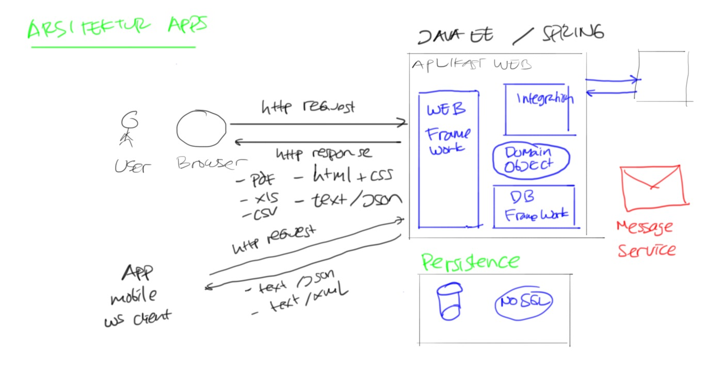
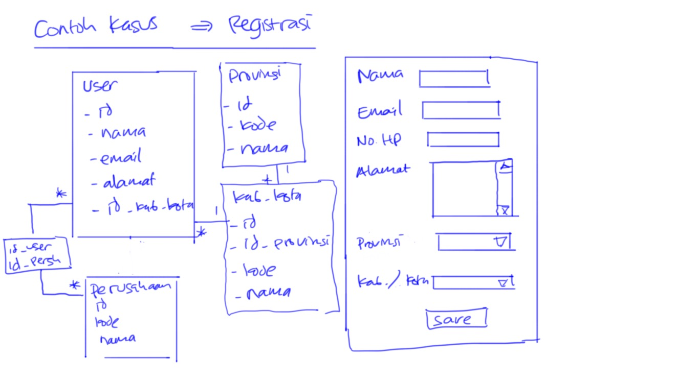

# Training Java EE 7 #

## Materi Training ##

* Membuat aplikasi dengan Java EE (Servlet, JSF)
* Membuat aplikasi dengan Struts 2
* Membuat aplikasi dengan Spring MVC

## Software yang dibutuhkan ##

* Java SDK
* Dependency Management

    * Apache Maven
    * Gradle

* Editor

    * Netbeans
    * Eclipse
    * Intellij IDEA
    * Visual Studio Code

* Database Server

    * MySQL
    * PostgreSQL

## Arsitektur Aplikasi ##



## Contoh Aplikasi ##




## Setup Database ##

1. Login ke database sebagai user `root`

        mysql -u root

2. Buat user untuk aplikasi

        CREATE USER 'trainingjee201801'@'localhost' IDENTIFIED BY 'test123';

3. Berikan ijin akses untuk database

        grant all on trainingjee201801.* to trainingjee201801@localhost;

4. Buat database

        create database trainingjee201801

5. Masuk ke database

        use trainingjee201801;

6. Buat tabel yang dibutuhkan

    ```sql
    create table perusahaan (
      id VARCHAR(36),
      kode VARCHAR(100) NOT NULL,
      nama VARCHAR(255) NOT NULL,
      PRIMARY KEY (id),
      UNIQUE (kode)
    ) Engine = InnoDB ;

    create table provinsi (
        id VARCHAR(36),
        kode VARCHAR(100) NOT NULL,
        nama VARCHAR(255) NOT NULL,
        PRIMARY KEY (id),
        UNIQUE (kode)
    ) Engine = InnoDB ;

    create table kabupaten_kota (
        id VARCHAR(36),
        kode VARCHAR(100) NOT NULL,
        nama VARCHAR(255) NOT NULL,
        id_provinsi varchar(36) not null,
        PRIMARY KEY (id),
        foreign key (id_provinsi) references provinsi(id),
        UNIQUE (kode)
    ) Engine = InnoDB ;

    create table t_user (
        id varchar(36), 
        nama varchar(255) not null,
        email varchar(255) not null,
        no_hp varchar(255) not null,
        alamat varchar(255) not null,
        id_kabupaten_kota varchar(36) not null,
        primary key (id),
        foreign key (id_kabupaten_kota) references kabupaten_kota(id)
    );

    create table user_perusahaan (
        id_user VARCHAR(36),
        id_perusahaan varchar(36) not null,
        PRIMARY KEY (id_user, id_perusahaan),
        foreign key (id_user) references t_user(id),
        foreign key (id_perusahaan) references perusahaan(id)
    ) Engine = InnoDB ;
    ```


